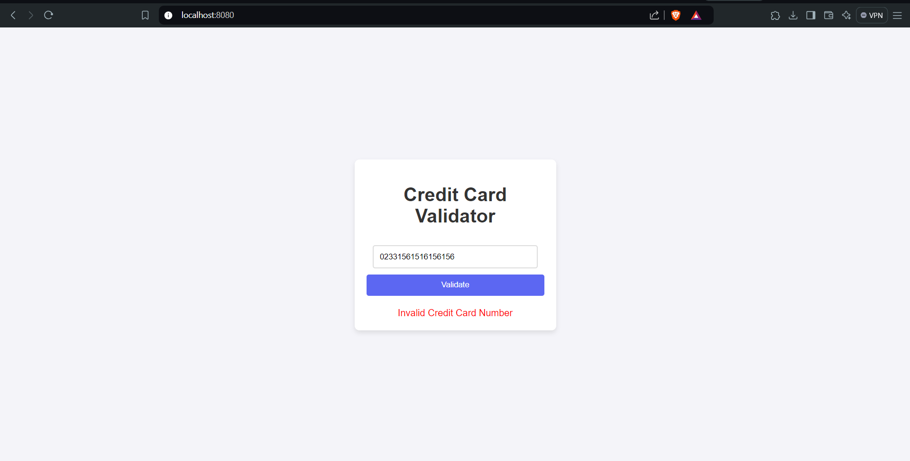

# Credit Card Validator

## Overview
The Credit Card Validator is a web application designed to validate credit card numbers using the Luhn algorithm. This project aims to provide a simple and effective tool for verifying the validity of credit card numbers, which can be particularly useful in e-commerce applications and financial software.

## Features
- **Credit Card Validation**: Utilizes the Luhn algorithm to check if a credit card number is valid.
- **User-Friendly Interface**: A clean, responsive web interface that allows users to easily enter a credit card number and get instant validation results.
- **RESTful API**: Provides a backend API that can be integrated with other applications or services.

## Technologies Used
- **Frontend**: HTML, CSS, JavaScript
- **Backend**: Go (Golang)
- **Deployment**: This application is set up to run locally but can be easily deployed to any cloud platform.

## Getting Started

### Prerequisites
- Go (version 1.14 or later recommended)
- Git (for cloning the repository)

### Installation

1. **Clone the repository:**
   ```bash
   git clone https://github.com/yourusername/credit-card-validator.git
   cd credit-card-validator
3. Navigate to the backend directory and run the server:
   cd backend
   go run main.go
4. Access the application: Open your web browser and visit http://localhost:8080 to use the application.

### Usage

Enter a credit card number into the input field on the web page and click the "Validate" button. The application will display whether the credit card number is valid or invalid according to the Luhn algorithm.

## Screenshots

### Valid Credit Card Number


### Invalid Credit Card Number

